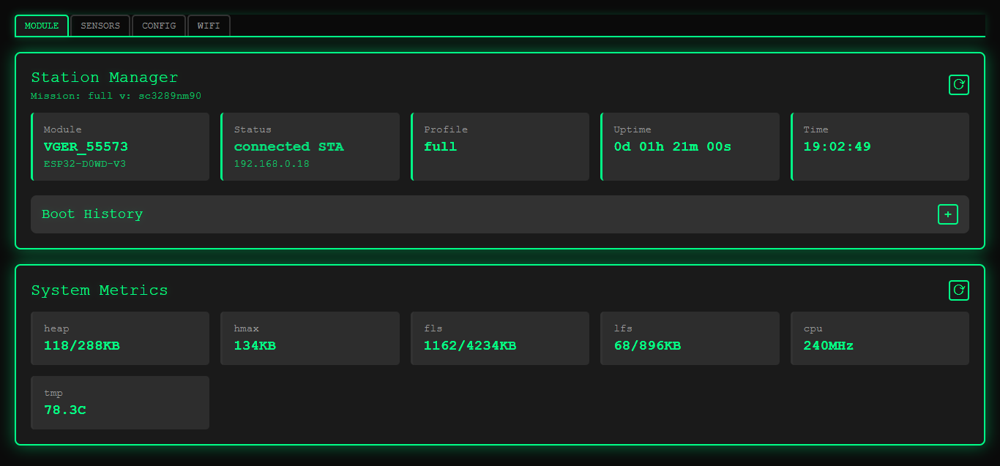
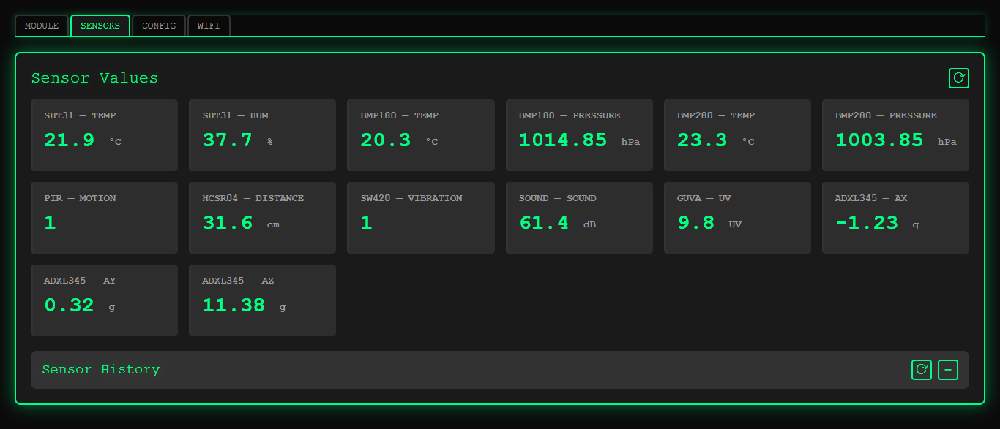
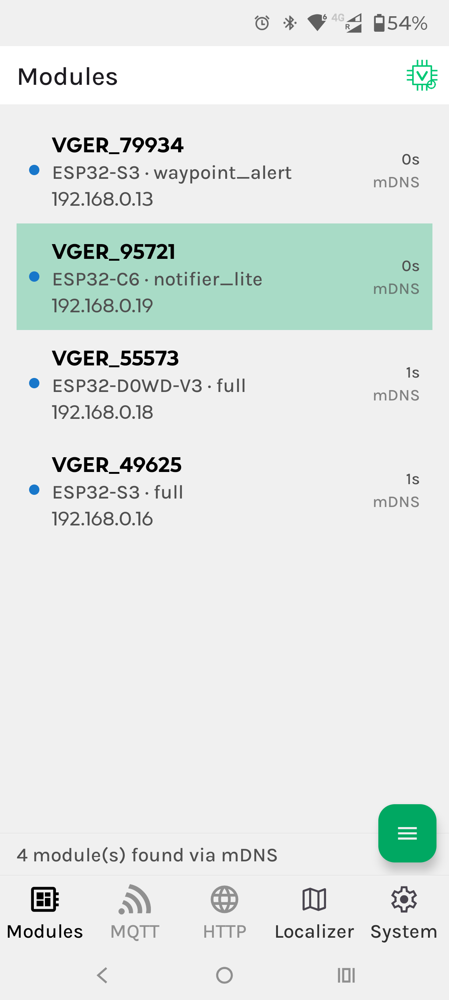
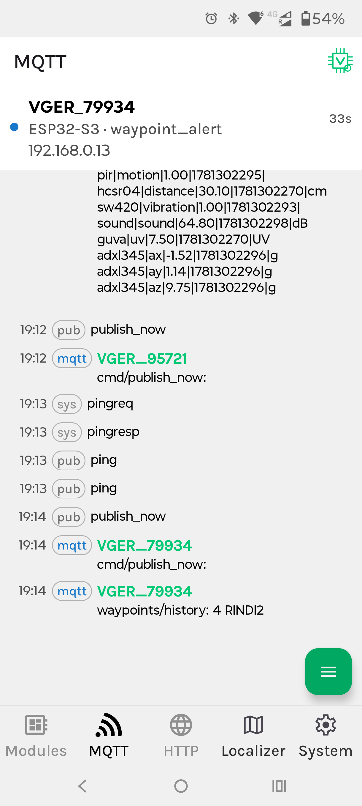
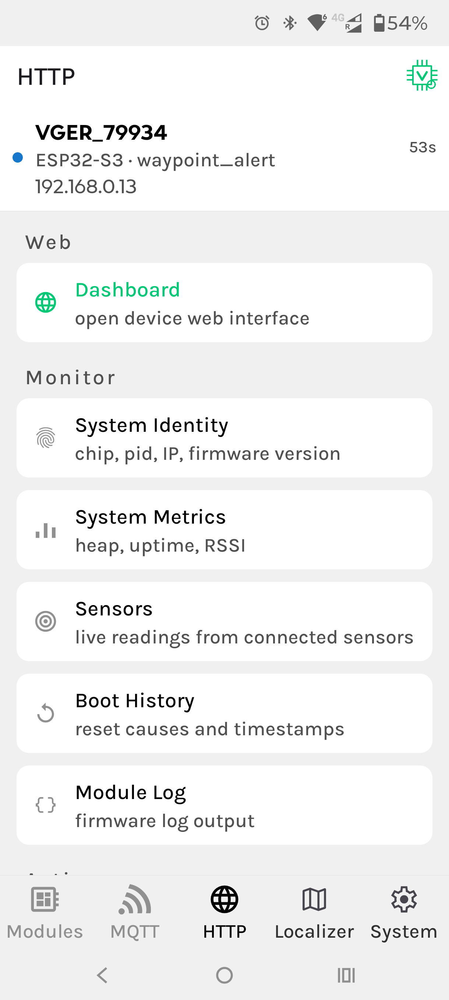
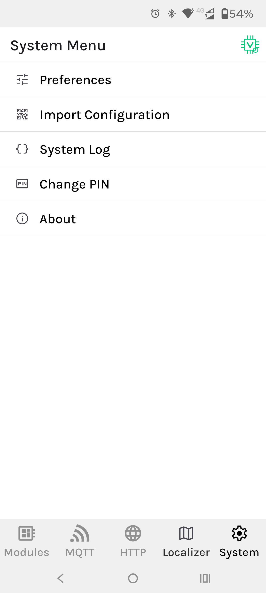

<div align="center">


*Reusable base for ESP32 IoT projects*

[](./LICENSE)
[](https://platformio.org/)
[](https://www.espressif.com/)
[](./android/Vger32App/app/build.gradle.kts)
</div>

VGER32 is a complete ESP32 ecosystem — firmware, Android app, and setup tool — built from scratch to solve the infrastructure problems every IoT project faces. WiFi management, HTTP API, embedded web dashboard, MQTT, indoor localization, device discovery, structured logging, deep sleep, and runtime configuration: all working, all integrated, all optional.

The architecture is modular by design. Mission profiles define what the device does. Hardware profiles define what it has. Both are independent, both are swappable. The same firmware runs a weather station, a motion alert node, or a display-based notifier — one file change.

Built for makers and developers who want a solid, maintainable base and zero time wasted rebuilding the same foundation twice.

## Screenshots

### Firmware Embedded Dashboard

<div align="center">

<br /><br />

</div>

### Companion Android App

<div align="center">
    
|  |  |  |  |
|:---:|:---:|:---:|:---:|

</div>

## Built-in capabilities

- WiFi management — STA/AP modes, configurable TX power, multi-chip support (ESP32, S3, C3, C6)
- Embedded HTTP server with web dashboard
- MQTT client with command dispatcher and payload scrambler
- WiFi-based indoor localization without GPS
- mDNS and UDP device discovery
- Runtime-configurable capabilities without recompiling
- Multi-level structured logging with in-memory buffer
- Deep sleep management with configurable grace period
- Boot history tracking

## Mission and hardware profiles

VGER32 separates *what the device does* from *what hardware it has*. A **mission profile** defines behavior — active sensors, MQTT strategy, sleep policy — independent of any specific board. A **hardware profile** defines what's connected — sensors, actuators, displays. Both are selected in a single file: `src/profiles/active_profile.h`.

### Included missions

| Mission | Description |
|---|---|
| `MISSION_WEATHER_STATION` | Publishes sensor data via MQTT |
| `MISSION_WAYPOINT_ALERT` | Audible alert on WiFi waypoint detection |
| `MISSION_NOTIFIER_LITE` | Waypoints and MQTT messages on a 1.47" display |
| `MISSION_FULL` | All subsystems active — demo mode |

### Included hardware profiles

| Profile | Description |
|---|---|
| `HARDWARE_WEATHER_V1` | SHT31 + BMP280 |
| `HARDWARE_WAYPOINT_V1` | KY-012 buzzer |
| `HARDWARE_NOTIFIER_V1` | Waveshare LCD 1.47" |
| `HARDWARE_FULL_V1` | No real hardware — simulated sensors |

New missions and profiles can be added without modifying existing code.

## System overview

```text
VGER32
├── ESP32 Firmware                        ← core
│   ├── Mission profiles
│   ├── Hardware profiles
│   ├── WiFi management
│   ├── HTTP API + web dashboard
│   ├── MQTT client + command dispatcher
│   ├── WiFi indoor localization
│   ├── Device discovery (mDNS + UDP)
│   ├── Structured logging
│   ├── Deep sleep management
│   └── Runtime configuration
│
└── Android App                           ← companion tool
    ├── Device discovery
    ├── Monitoring + sensor data
    ├── Configuration
    └── Command execution
```

## Components

- Firmware → [`esp32/vger32`](./esp32/vger32/README.md)
- Android → [`android/Vger32App`](./android/Vger32App/README.md)

## Conventions

- Firmware → [`esp32/vger32/CODE_CONVENTIONS.txt`](./esp32/vger32/CODE_CONVENTIONS.txt)
- Android → [`android/Vger32App/CODE_CONVENTIONS.txt`](./android/Vger32App/CODE_CONVENTIONS.txt)

## Project status

Functional and actively developed. Currently in beta — stable enough to build on, with new features, hardware profiles, and improvements landing continuously.

## Contributing

VGER32 is an open project and contributions are genuinely welcome — whether it is a new sensor driver, a hardware profile, a mission, or just feedback on what could be better. Open an issue or a pull request; every contribution is appreciated.

## License

MIT — see [`LICENSE`](./LICENSE)
